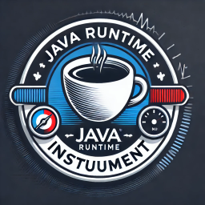

#  Java Runtime Instrument



Welcome to the Java Runtime Instrument! This tool allows you to directly obtain the runtime state of your Java program via API usage. 
It can capture the following information:

- The sequence of method executions
- The input parameters of each executed method
- The exceptions thrown by each method
- The line number information during the execution of each method

Most importantly, the instrumentation process does not interfere with the original execution logic of the program.

## Features

- **Lightweight**: The instrumentation process has minimal impact on program performance.
- **Non-intrusive**: It does not alter the execution logic of the program.
- **Real-time Information**: Detailed execution information can be obtained while the program is running.
- **Highly Customizable**: You can tailor the monitoring data to suit your specific needs.

## Usage
```
Executor.instrumentAndExecute(jarPaths, 
                              "edu.fdu.se.test.service.impl.UserServiceImpl", 
                              "getUserById", 
                              new Class[]{int.class}, 
                              new Object[]{5});
System.out.println(record.getMethodExecuteSigSet());
```

## Installation

You can install and use this tool through the following methods:

### Maven

Add the following dependency to your `pom.xml` file:

```xml
<dependency>
    <groupId>edu.fdu.se</groupId>
    <artifactId>java-runtime-instrument</artifactId>
    <version>1.0.0</version>
</dependency>
```